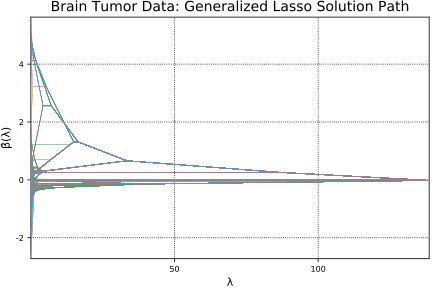

# Brain Tumor Data

Here we estimate a generalized lasso model (sparse fused lasso) via the constrained lasso. 

In this example, we use a version of the comparative genomic hybridization (CGH) data from [Bredel et al. (2005)](../references.md#2) that was modified and studied by [Tibshirani and Wang (2008)](../references.md#6)

The dataset here contains CGH measurements from 2 glioblastoma multiforme (GBM) brain tumors. Tibshirani and Wang (2008) proposed using the sparse fused lasso to approximate the CGH signal by a sparse, piecewise constant function in order to determine the areas with non-zero values, as positive (negative) CGH values correspond to possible gains (losses). The sparse fused lasso (Tibshirani et al., 2005) is given by

```math
\begin{split}
\text{minimize} \hspace{1em} \frac 12 ||\boldsymbol{y}-\boldsymbol{\beta}||_2^2 + \rho_1||\boldsymbol{\beta}||_1 + \rho_2\sum_{j=2}^p |\beta_j - \beta_{j-1}| \hspace{5em} (1)
\end{split}
```
The sparse fused lasso is a special case of the generalized lasso with the penalty matrix. Therefore, the problem ``(1)`` is equivalent to the following: 

```math 
\begin{split} 
\text{minimize} \hspace{1em} \frac 12 ||\boldsymbol{y}-\boldsymbol{X\beta}||_2^2 + \rho ||\boldsymbol{D\beta}||_1 \hspace{5em} (2)
\end{split}
```
where 

```math
\boldsymbol{D} = \begin{pmatrix} 
1 & -1 &     &    	  &       & 	& \\
  & 1  & -1  &    	  &  		&	& \\
  &    &  1  & -1 	  & 		& 	& \\
  &		&		& \ddots & \ddots &  & \\
  &		&		&		 &			& 1 & -1 \\
1 &  &     &    	  &       & 	& \\
  & 1  &   &    	  &  		&	& \\
  &    &  \ddots  &  	  & 		& 	& \\
  & 	&          & & \ddots & & \\
  &		&		     &      &       & 1 & \\
  &		&		&		 &			    &  & 1\\  
\end{pmatrix} \in \mathbb{R}^{(2P-1)\times p}.

```
As discussed in [Gaines, B.R. and Zhou, H., (2016)](../references.md), the sparse fused lasso can be reformulated and solved as a constrained lasso problem. The generalized lasso problem ``(2)`` is equivalent to 

```math 
\begin{split}
& \text{minimize} \hspace{1em} \frac 12 ||\widetilde{\boldsymbol{y}} -\widetilde{\boldsymbol{X}}\boldsymbol{\alpha}||_2^2 + \rho||\boldsymbol{\alpha}||_1 \hspace{5em} (3) \\
& \text{subject to} \hspace{1em} \boldsymbol{U}^T_2\boldsymbol{\alpha} = \boldsymbol{0}
\end{split}
```
where $\widetilde{\boldsymbol{y}} = (\boldsymbol{I}-\boldsymbol{P}_{\boldsymbol{XV}_2})\boldsymbol{y},  \hspace{0.5em} \widetilde{\boldsymbol{X}} = (\boldsymbol{I}-\boldsymbol{P}_{\boldsymbol{XV}_2})\boldsymbol{XD}^+$. Note $D^+$ is the Moore-Penrose inverse of the matrix $\boldsymbol{D}.$ and $\boldsymbol{U_2}, \boldsymbol{V_2}$ are obtained from singular value decomposition (SVD) of ``\boldsymbol{D}`` matrix. Then, the solution path ``
\widehat{\boldsymbol{\alpha}}(\rho)`` can be translated back to that of the original generalized lasso problem via 

```math 
\widehat{\boldsymbol{\beta}}(\rho) = [\boldsymbol{I}-\boldsymbol{V}_2(\boldsymbol{V}_2^T\boldsymbol{X}^T\boldsymbol{X}\boldsymbol{V}_2)^-\boldsymbol{V}_2^T\boldsymbol{X}^T\boldsymbol{X}]\boldsymbol{D}^+\hat{\boldsymbol{\alpha}}(\rho)+ \boldsymbol{V}_2(\boldsymbol{V}_2^T\boldsymbol{X}^T\boldsymbol{X}\boldsymbol{V}_2)^-\boldsymbol{V}_2^T\boldsymbol{X}^T\boldsymbol{y}
```
where $\boldsymbol{X}^-$ denotes the generalized inverse of a matrix $\boldsymbol{X}$.

Details are found in Section 2 of [[3](../references.md)]. 


```julia
using ConstrainedLasso
```

We load and organize the data first. Here, `y` is the response vector. The design matrix `X` is an identity matrix since the objective function in ``(1)`` does not involve `X`. 


```julia
y = readdlm("misc/tumor.txt")
```


    990×1 Array{Float64,2}:
      0.333661 
     -0.152838 
      0.101485 
     -0.0342123
      0.344761 
      0.151108 
      0.798318 
      0.282754 
      0.116233 
     -0.232173 
     -0.754577 
      1.06762  
     -0.017392 
      ⋮        
     -0.170825 
     -0.161826 
     -0.348987 
     -0.001227 
     -0.221422 
      0.552795 
     -0.603429 
     -0.447907 
     -0.317569 
     -0.728202 
     -0.505593 
     -0.147661 


```julia
n = p = size(y, 1)
X = eye(n)
```


    990×990 Array{Float64,2}:
     1.0  0.0  0.0  0.0  0.0  0.0  0.0  0.0  …  0.0  0.0  0.0  0.0  0.0  0.0  0.0
     0.0  1.0  0.0  0.0  0.0  0.0  0.0  0.0     0.0  0.0  0.0  0.0  0.0  0.0  0.0
     0.0  0.0  1.0  0.0  0.0  0.0  0.0  0.0     0.0  0.0  0.0  0.0  0.0  0.0  0.0
     0.0  0.0  0.0  1.0  0.0  0.0  0.0  0.0     0.0  0.0  0.0  0.0  0.0  0.0  0.0
     0.0  0.0  0.0  0.0  1.0  0.0  0.0  0.0     0.0  0.0  0.0  0.0  0.0  0.0  0.0
     0.0  0.0  0.0  0.0  0.0  1.0  0.0  0.0  …  0.0  0.0  0.0  0.0  0.0  0.0  0.0
     0.0  0.0  0.0  0.0  0.0  0.0  1.0  0.0     0.0  0.0  0.0  0.0  0.0  0.0  0.0
     0.0  0.0  0.0  0.0  0.0  0.0  0.0  1.0     0.0  0.0  0.0  0.0  0.0  0.0  0.0
     0.0  0.0  0.0  0.0  0.0  0.0  0.0  0.0     0.0  0.0  0.0  0.0  0.0  0.0  0.0
     0.0  0.0  0.0  0.0  0.0  0.0  0.0  0.0     0.0  0.0  0.0  0.0  0.0  0.0  0.0
     0.0  0.0  0.0  0.0  0.0  0.0  0.0  0.0  …  0.0  0.0  0.0  0.0  0.0  0.0  0.0
     0.0  0.0  0.0  0.0  0.0  0.0  0.0  0.0     0.0  0.0  0.0  0.0  0.0  0.0  0.0
     0.0  0.0  0.0  0.0  0.0  0.0  0.0  0.0     0.0  0.0  0.0  0.0  0.0  0.0  0.0
     ⋮                        ⋮              ⋱            ⋮                      
     0.0  0.0  0.0  0.0  0.0  0.0  0.0  0.0     0.0  0.0  0.0  0.0  0.0  0.0  0.0
     0.0  0.0  0.0  0.0  0.0  0.0  0.0  0.0     0.0  0.0  0.0  0.0  0.0  0.0  0.0
     0.0  0.0  0.0  0.0  0.0  0.0  0.0  0.0  …  0.0  0.0  0.0  0.0  0.0  0.0  0.0
     0.0  0.0  0.0  0.0  0.0  0.0  0.0  0.0     0.0  0.0  0.0  0.0  0.0  0.0  0.0
     0.0  0.0  0.0  0.0  0.0  0.0  0.0  0.0     0.0  0.0  0.0  0.0  0.0  0.0  0.0
     0.0  0.0  0.0  0.0  0.0  0.0  0.0  0.0     1.0  0.0  0.0  0.0  0.0  0.0  0.0
     0.0  0.0  0.0  0.0  0.0  0.0  0.0  0.0     0.0  1.0  0.0  0.0  0.0  0.0  0.0
     0.0  0.0  0.0  0.0  0.0  0.0  0.0  0.0  …  0.0  0.0  1.0  0.0  0.0  0.0  0.0
     0.0  0.0  0.0  0.0  0.0  0.0  0.0  0.0     0.0  0.0  0.0  1.0  0.0  0.0  0.0
     0.0  0.0  0.0  0.0  0.0  0.0  0.0  0.0     0.0  0.0  0.0  0.0  1.0  0.0  0.0
     0.0  0.0  0.0  0.0  0.0  0.0  0.0  0.0     0.0  0.0  0.0  0.0  0.0  1.0  0.0
     0.0  0.0  0.0  0.0  0.0  0.0  0.0  0.0     0.0  0.0  0.0  0.0  0.0  0.0  1.0


First we create a penalty matrix `D`. 


```julia
D = [eye(p-1) zeros(p-1, 1)] - [zeros(p-1, 1) eye(p-1)]
```


    989×990 Array{Float64,2}:
     1.0  -1.0   0.0   0.0   0.0   0.0  …   0.0   0.0   0.0   0.0   0.0   0.0
     0.0   1.0  -1.0   0.0   0.0   0.0      0.0   0.0   0.0   0.0   0.0   0.0
     0.0   0.0   1.0  -1.0   0.0   0.0      0.0   0.0   0.0   0.0   0.0   0.0
     0.0   0.0   0.0   1.0  -1.0   0.0      0.0   0.0   0.0   0.0   0.0   0.0
     0.0   0.0   0.0   0.0   1.0  -1.0      0.0   0.0   0.0   0.0   0.0   0.0
     0.0   0.0   0.0   0.0   0.0   1.0  …   0.0   0.0   0.0   0.0   0.0   0.0
     0.0   0.0   0.0   0.0   0.0   0.0      0.0   0.0   0.0   0.0   0.0   0.0
     0.0   0.0   0.0   0.0   0.0   0.0      0.0   0.0   0.0   0.0   0.0   0.0
     0.0   0.0   0.0   0.0   0.0   0.0      0.0   0.0   0.0   0.0   0.0   0.0
     0.0   0.0   0.0   0.0   0.0   0.0      0.0   0.0   0.0   0.0   0.0   0.0
     0.0   0.0   0.0   0.0   0.0   0.0  …   0.0   0.0   0.0   0.0   0.0   0.0
     0.0   0.0   0.0   0.0   0.0   0.0      0.0   0.0   0.0   0.0   0.0   0.0
     0.0   0.0   0.0   0.0   0.0   0.0      0.0   0.0   0.0   0.0   0.0   0.0
     ⋮                             ⋮    ⋱         ⋮                          
     0.0   0.0   0.0   0.0   0.0   0.0      0.0   0.0   0.0   0.0   0.0   0.0
     0.0   0.0   0.0   0.0   0.0   0.0      0.0   0.0   0.0   0.0   0.0   0.0
     0.0   0.0   0.0   0.0   0.0   0.0      0.0   0.0   0.0   0.0   0.0   0.0
     0.0   0.0   0.0   0.0   0.0   0.0  …   0.0   0.0   0.0   0.0   0.0   0.0
     0.0   0.0   0.0   0.0   0.0   0.0      0.0   0.0   0.0   0.0   0.0   0.0
     0.0   0.0   0.0   0.0   0.0   0.0      0.0   0.0   0.0   0.0   0.0   0.0
     0.0   0.0   0.0   0.0   0.0   0.0     -1.0   0.0   0.0   0.0   0.0   0.0
     0.0   0.0   0.0   0.0   0.0   0.0      1.0  -1.0   0.0   0.0   0.0   0.0
     0.0   0.0   0.0   0.0   0.0   0.0  …   0.0   1.0  -1.0   0.0   0.0   0.0
     0.0   0.0   0.0   0.0   0.0   0.0      0.0   0.0   1.0  -1.0   0.0   0.0
     0.0   0.0   0.0   0.0   0.0   0.0      0.0   0.0   0.0   1.0  -1.0   0.0
     0.0   0.0   0.0   0.0   0.0   0.0      0.0   0.0   0.0   0.0   1.0  -1.0


Now we transform the problem to the constrained lasso problem. We do the singular value decomposition on `D` and extract singular values and necessary submatrices.  


```julia
m = size(D, 1)
F = svdfact!(D, thin = false)
singvals = F[:S]
rankD = countnz(F[:S] .> abs(F[:S][1]) * eps(F[:S][1]) * maximum(size(D)))

V1 = F[:V][:, 1:rankD]
V2 = F[:V][:, rankD+1:end]
U1 = F[:U][:, 1:rankD]
U2 = F[:U][:, rankD+1:end];
```

Now we calculate the Moore-Penrose inverse of `D`, which is ``D^+`` in ``(3)``, and transform the design matrix by multiplying by ``D^+``. 


```julia
Dplus = V1 * broadcast(*, U1', 1./F[:S])
XDplus = X * Dplus;
```

In the following code snippet, `Pxv2` is a projection matrix onto `C(XV2)` and `Mxv2` is the orthogonal projection matrix. Then we obtain the design matrix and response vector in their tilde form as shown in ``(3)``. 


```julia
XV2 = X * V2
Pxv2 = (1 / dot(XV2, XV2)) * A_mul_Bt(XV2, XV2)
Mxv2 = eye(size(XV2, 1)) - Pxv2
ỹ = vec(Mxv2 * y)
```


    990-element Array{Float64,1}:
      0.351554   
     -0.134946   
      0.119377   
     -0.0163198  
      0.362654   
      0.169001   
      0.816211   
      0.300646   
      0.134125   
     -0.214281   
     -0.736685   
      1.08552    
      0.000500562
      ⋮          
     -0.152933   
     -0.143933   
     -0.331094   
      0.0166656  
     -0.203529   
      0.570688   
     -0.585536   
     -0.430014   
     -0.299676   
     -0.71031    
     -0.487701   
     -0.129769   


```julia
X̃ = Mxv2 * XDplus
```


    990×989 Array{Float64,2}:
      0.99899     0.99798     0.99697    …   0.0030303   0.0020202   0.0010101
     -0.0010101   0.99798     0.99697        0.0030303   0.0020202   0.0010101
     -0.0010101  -0.0020202   0.99697        0.0030303   0.0020202   0.0010101
     -0.0010101  -0.0020202  -0.0030303      0.0030303   0.0020202   0.0010101
     -0.0010101  -0.0020202  -0.0030303      0.0030303   0.0020202   0.0010101
     -0.0010101  -0.0020202  -0.0030303  …   0.0030303   0.0020202   0.0010101
     -0.0010101  -0.0020202  -0.0030303      0.0030303   0.0020202   0.0010101
     -0.0010101  -0.0020202  -0.0030303      0.0030303   0.0020202   0.0010101
     -0.0010101  -0.0020202  -0.0030303      0.0030303   0.0020202   0.0010101
     -0.0010101  -0.0020202  -0.0030303      0.0030303   0.0020202   0.0010101
     -0.0010101  -0.0020202  -0.0030303  …   0.0030303   0.0020202   0.0010101
     -0.0010101  -0.0020202  -0.0030303      0.0030303   0.0020202   0.0010101
     -0.0010101  -0.0020202  -0.0030303      0.0030303   0.0020202   0.0010101
      ⋮                                  ⋱                                    
     -0.0010101  -0.0020202  -0.0030303      0.0030303   0.0020202   0.0010101
     -0.0010101  -0.0020202  -0.0030303      0.0030303   0.0020202   0.0010101
     -0.0010101  -0.0020202  -0.0030303  …   0.0030303   0.0020202   0.0010101
     -0.0010101  -0.0020202  -0.0030303      0.0030303   0.0020202   0.0010101
     -0.0010101  -0.0020202  -0.0030303      0.0030303   0.0020202   0.0010101
     -0.0010101  -0.0020202  -0.0030303      0.0030303   0.0020202   0.0010101
     -0.0010101  -0.0020202  -0.0030303      0.0030303   0.0020202   0.0010101
     -0.0010101  -0.0020202  -0.0030303  …   0.0030303   0.0020202   0.0010101
     -0.0010101  -0.0020202  -0.0030303      0.0030303   0.0020202   0.0010101
     -0.0010101  -0.0020202  -0.0030303     -0.99697     0.0020202   0.0010101
     -0.0010101  -0.0020202  -0.0030303     -0.99697    -0.99798     0.0010101
     -0.0010101  -0.0020202  -0.0030303     -0.99697    -0.99798    -0.99899  


We solve the constrained lasso problem and obtain $\widehat{\boldsymbol{\alpha}}(\rho)$.


```julia
using Mosek
solver=MosekSolver()
α̂path, ρpath, = lsq_classopath(X̃, ỹ; solver=solver)
```

Now we need to transform $\widehat{\boldsymbol{\alpha}} (\rho)$ back to $\widehat{\boldsymbol{\beta}} (\rho)$ as seen in (3).


```julia
# transform back to beta
β̂path = Base.LinAlg.BLAS.ger!(1.0, vec(V2 * ((1 / dot(XV2, XV2)) * 
		At_mul_B(XV2, y))), ones(size(ρpath)), (eye(size(V2, 1)) - 
		V2 * ((1 / dot(XV2, XV2)) * At_mul_B(XV2, X))) * Dplus * α̂path )
```


    990×989 Array{Float64,2}:
     -0.0178926  -0.0046696   0.118695    0.258754   …   0.333516     0.333644  
     -0.0178926  -0.0046696   0.118695    0.258754      -0.152548    -0.152803  
     -0.0178926  -0.0046696   0.118695    0.258754       0.101194     0.10145   
     -0.0178926  -0.0046696   0.118695    0.258754      -0.0339217   -0.0341772 
     -0.0178926  -0.0046696   0.118695    0.258754       0.34447      0.344726  
     -0.0178926  -0.0046696   0.118695    0.258754   …   0.151399     0.151143  
     -0.0178926  -0.0046696   0.118695    0.258754       0.798027     0.798283  
     -0.0178926  -0.0046696   0.118695    0.258754       0.282754     0.282754  
     -0.0178926  -0.0046696   0.118695    0.258754       0.116233     0.116233  
     -0.0178926  -0.0046696   0.118695    0.258754      -0.232173    -0.232173  
     -0.0178926  -0.0046696   0.118695    0.258754   …  -0.754287    -0.754542  
     -0.0178926  -0.0046696   0.118695    0.258754       1.06733      1.06759   
     -0.0178926  -0.0046696   0.118695    0.258754      -0.0171014   -0.0173569 
      ⋮                                              ⋱                          
     -0.0178926  -0.0212612  -0.0504995  -0.0838215     -0.170534    -0.17079   
     -0.0178926  -0.0212612  -0.0504995  -0.0838215     -0.162116    -0.161861  
     -0.0178926  -0.0212612  -0.0504995  -0.0838215  …  -0.348696    -0.348952  
     -0.0178926  -0.0212612  -0.0504995  -0.0838215     -0.00151764  -0.00126215
     -0.0178926  -0.0212612  -0.0504995  -0.0838215     -0.221131    -0.221386  
     -0.0178926  -0.0212612  -0.0504995  -0.0838215      0.552504     0.55276   
     -0.0178926  -0.0212612  -0.0504995  -0.0838215     -0.603138    -0.603394  
     -0.0178926  -0.0212612  -0.0504995  -0.0838215  …  -0.447907    -0.447907  
     -0.0178926  -0.0212612  -0.0504995  -0.0838215     -0.31786     -0.317604  
     -0.0178926  -0.0212612  -0.0504995  -0.0838215     -0.727912    -0.728167  
     -0.0178926  -0.0212612  -0.0504995  -0.0838215     -0.505593    -0.505593  
     -0.0178926  -0.0212612  -0.0504995  -0.0838215     -0.147807    -0.147679  


We plot the constrained lasso solution path below. 


```julia
using Plots; pyplot(); # hide
plot(ρpath, β̂path', label="", xaxis = ("ρ", (minimum(ρpath),
      maximum(ρpath))), yaxis = ("β̂(ρ)"), width=0.5)
title!("Brain Tumor Data: Solution Path via Constrained Lasso")
```


Now let's compare our estimates with those from generalized lasso.  

Variables `lambda_path` and `beta_path_fused` are lambda values and estimated beta coefficients, respectively, obtained from `genlasso` package in `R`. 


```julia
lambda_path = readdlm("misc/lambda_path.txt")
beta_path_fused = readdlm("misc/beta_path_fused.txt")[2:end, :]
```

The following figure plots generalized lasso solution path. 


```julia
plot(lambda_path, beta_path_fused', label="", xaxis = ("λ", (minimum(lambda_path),
      maximum(lambda_path))), yaxis = ("β̂(λ)"), width=0.5)
title!("Brain Tumor Data: Generalized Lasso Solution Path")
```



Now we extract common values of $\rho$ and compare estimates at those values. 


```julia
sameρ = intersect(round.(ρpath, 4), round.(lambda_path, 4))
sameρ_err = []
for i in eachindex(sameρ)
 curρ = sameρ[i]
 idx1 = findmin(abs.(ρpath - curρ))[2]
 idx2 = findmin(abs.(lambda_path - curρ))[2]
 push!(sameρ_err, maximum(abs.(β̂path[:, idx1] - beta_path_fused[:, idx2])))
end
sameρ_err
```


    988-element Array{Any,1}:
     1.22121e-9
     2.47148e-9
     4.33354e-9
     4.3335e-9 
     3.64469e-8
     4.41366e-8
     3.35e-8   
     4.53911e-8
     4.29568e-7
     3.18004e-7
     4.94452e-7
     2.62003e-7
     3.8775e-7 
     ⋮         
     5.00008e-7
     4.89495e-7
     4.87999e-7
     4.95e-7   
     4.78989e-7
     4.86001e-7
     4.96003e-7
     4.99498e-7
     4.86994e-7
     4.86994e-7
     4.89997e-7
     4.83994e-7


Below are the mean, median, and maximum of the errors between estimated coefficients at common ``\rho`` values. 


```julia
println([mean(sameρ_err); median(sameρ_err); maximum(sameρ_err)])
```

    [4.77914e-7, 4.80866e-7, 5.00013e-7]

